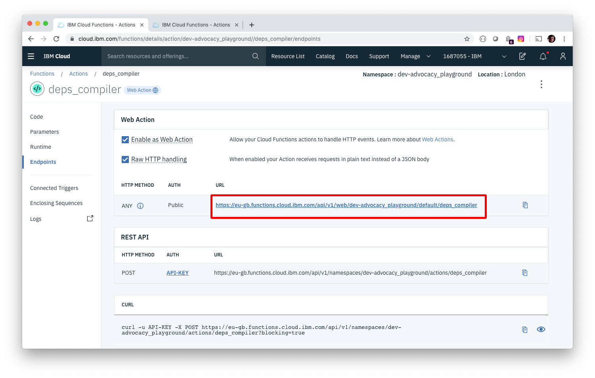

# OpenWhisk Dependency Compiler
A serverless function for compiling Node.js dependencies for serverless functions.

## What's this all about?


### The Problem

Serverless functions are great, but for some functions, shipping dependencies + packages that makes your life easier is a little tricky. 

If all of your dependencies are written in pure JS, you're pretty set to go, you just need to install them, zip them up, and send them on your way. 

But, if one or more of your dependencies have a native component, you're in trouble. If you're lucky to be running the same operating system as the environment you're planning to deploy your serverless function to, you're good to go, but this is often not the case - and installing Docker images to compile dependencies is a nightmare too.

### A Solution

With this function, you can send up your `package.json` file for your serverless project where they'll be installed, zipped up, and returned to you for deployment.

This way, your compiling your dependencies in the exact environment you'll be shipping your function to.

## It can't be that simple...

Oh! but it can be, dear reader! Once you've set up this function, you can compile your Node.js modules with a single cURL command a bit like this:

```
curl -X POST -H "Content-Type: application/json" -d @package.json https://<HOST_FOR_YOUR_OPENWHISK_FUNCTIONS>/api/v1/web/<YOUR FUNCTION PATH>?secret=<YOUR FUNCTION SECRET> -o deps.tar.gz
```

This will send up your `package.json` file to compiler function, which will install the dependencies, whack them in a tar file, and send them back to your computer.

Then you're good to go.

## OK, how do I use this then?

I'm glad you asked. By following the instructions below, you'll be able to create, host and invoke the `openwhisk-dependency-compiler` function on the IBM Cloud - then you'll never have to worry about deployment target compatability ever again.

## Setting up with the IBM Cloud UI

If you don't have an IBM Cloud account, you can [create one here](https://cloud.ibm.com/registration)

Once you've done that, log in, and you'll be presented with the dashboard.


Once there, click the hamburger menu (highlighted in red) and then click the "Functions" option (highlighted in green)


This will take you to the IBM Cloud Functions dashboard (IBM Cloud Functions are powered by OpenWhisk) We're going to create an action, so click on the "Actions" button (highlighted in purple)


If you've made serverless functions before, you'll see a list much like the one in the image below, if not, don't worry, this'll be your first!

Click the "Create button" (highlighted in red)


You'll be given a series of options on how you'd like to create your function. Click "Create Action" (highlighted in green)


This will take you through to the "Create Action" UI. Give your function any name you like, I'm going to call mine "deps_compiler".

Make sure the runtime that's selected matches the runtime that you intend to deploy your dependencies to, otherwise this may not work.

Once you've entered a valid name, click the create button (highlighted in red)


If all goes well, our function is now created! 🎉

You should see a window for inputting code, and you'll notice that it doesn't do very much yet, but that's about to change.


Open up the [main.js](main.js) file in this repo, and copy all of the code in there, delete the default code in the textarea, then paste the contents of main.js in its place. 

Then hit save (highlighted in green)


We now have a serverless function that we can use to compile our Node.js dependencies, but we're not quite done yet. We need to configure out function to recieve a HTTP request with our `package.json` full of dependencies to compile.

Fortunately, this isn't too difficult.

Click the "Endpoints" button (highlighted in purple)


Once in the endpoints view, click the checkboxes for "Enable as a Web Action" and "Raw HTTP Handling" (highlighted in green) and then click the "Save" button (highlighted in red)


This will create a URL that we can make a `POST` request to with our `package.json` file which will return our compiled dependencies!

Right now, this endpoint is public, so anybody could trigger it, which isn't great if you want to keep your costs low, so we're going to set a parameter with a key that will only let us activate the function.

Click on the "Parameters" button (highlighted in green)


This will load the "Parameters" view. Click "Add Parameter" button (highlighted in purple)


Then create a parameter with the name `invocation_secret` and set a value (essentially a password for your function) and then click save (highlighted in red). Don't forget to put double quotes around your parameter value.


And that's it, we're good to go!

Go back to the "Endpoints" view and then copy the HTTP URL for your serverless function (highlighted in green) and then open up a terminal window.



In your terminal window, enter the following cURL command to compile the dependencies for any Node.js serverless function.

`curl -X POST -H "Content-Type: application/json" -d @<PATH TO YOUR package.json FILE> <THE URL YOU JUST COPIED>?secret=<YOUR INVOCATION_SECRET VALUE> -o deps.tar.gz`

Once the request is completed, you will have a new file called `deps.tar.gz` which contains your newly compiled `node_modules` directory. Now you can package them up and deploy them however you like.

